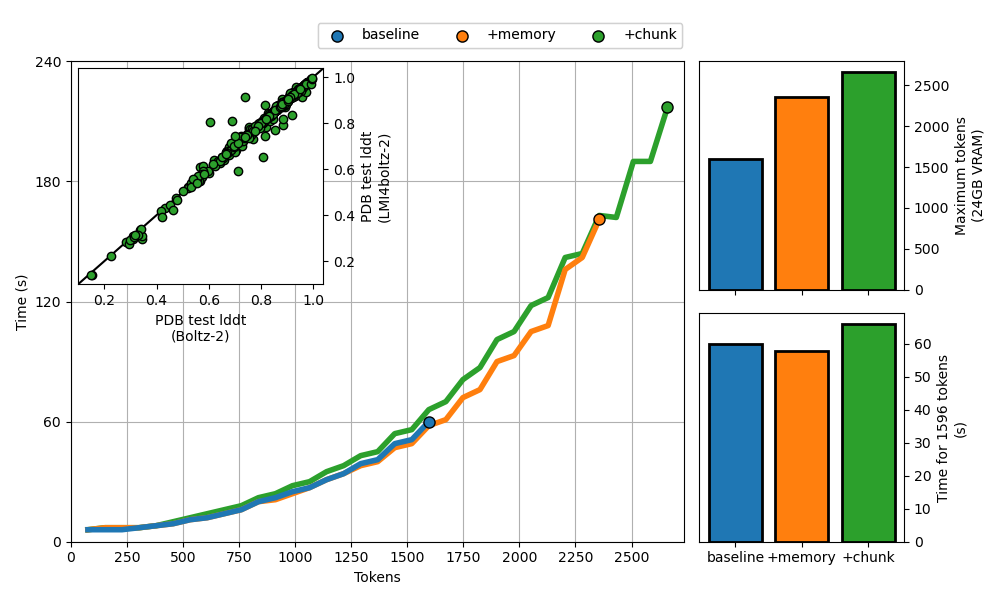

# Low Memory Inference for Boltz (LMI4Boltz)

## Overview

LMI4Boltz is a fork of [`jwohlwend/boltz`](https://github.com/jwohlwend/boltz), an open-source re-implementation of AlphaFold3. LMI4Boltz enables efficient prediction of large molecular complexes on consumer-grade hardware by reducing VRAM requirements. The Boltz README can be viewed [here](README.orig.md).

## Motivation

While AlphaFold3 offers accurate and efficient molecular structure prediction, it has license conditions which restrict general purpose use. Boltz is an open source re-implementation but the VRAM utilisation can require high-end GPUs to model large complexes. LMI4Boltz addresses this by:
- Updating the pair representation in-place.
- Offloading infrequently used tensors to host memory.
- Maintaining the pair representation at reduced precision.
- Aggressively chunking memory-intensive operations.

This allows for:
- Significantly increasing the token size limit (100% for Boltz-1, 67% for Boltz-2).
- Neglible change in execution time.
- Near-exact reproduction of original outputs (small differences due to numerical precision).

## Result Plot



Figure 1 (A) Execution time required to predict the structure of an increasing number of ubiquitin subunits using each of the Boltz-2 implementations. (B) Maximum number of tokens able to be predicted before registering an out-of-memory error with 24GB VRAM. (C) Wall time required to predict the structure of 21 ubiquitin subunits (1596 tokens). (D) lddt of the PDB test set of LMI4boltz compared with the original Boltz-2 implementation.

## Quick Start

1. **Clone the repository:**
   ```bash
   git clone https://github.com/tlitfin/lmi4boltz.git
   cd lmi4boltz
   ```

2. **Install dependencies:**
   ```bash
   pip install .[cuda]
   ```

3. **Run inference:**

   Run [boltz prediction](/docs/prediction.md) as usual with
   ```bash
   export PYTORCH_CUDA_ALLOC_CONF=expandable_segments:True
   boltz predict <INPUT_PATH> --use_msa_server
   ```

## Options

Detailed prediction instructions are available [here](docs/prediction.md). LMI4Boltz additional parameters can be used to reduce peak memory utilization.

| **Option**                     | **Type**  | **Default** | **Description**                           |
|--------------------------------|-----------|-------------|-------------------------------------------|
| `--chunk_size_transition_z`    | `INTEGER` |    `None`   | Transition Z chunk size.                  |
| `--chunk_size_transition_msa`  | `INTEGER` |     `32`    | Transition MSA chunk size.                |
| `--chunk_size_tri_attn`        | `INTEGER` |    `128`    | Triangle attention chunk size.            |
| `--triangle_mult_gate_nchunks` | `INTEGER` |     `1`     | Triangle multiplication number of chunks. |
| `--chunk_size_outer_product`   | `INTEGER` |     `4`     | Outer product chunk size.                 |
| `--chunk_size_threshold`       | `INTEGER` |    `384`    | Maximum size before chunking.             |
| `--use_bfloat16`               | `FLAG`    |   `False`   | Whether to use bfloat16 for Boltz-1       |

## Attribution

This project is based on [`jwohlwend/boltz`](https://github.com/jwohlwend/boltz). All core model architecture and original code are credited to the original authors. This fork extends their work with low-memory inference optimizations.

## License

See [LICENSE](LICENSE) for details. Please respect the original license and citation requirements.